# Introduction

Humans have always had a need for predicting the weather to know when to plant food and to stay safe from severe weather events. Predictions have been made historically through observations and measurements of the atmosphere. This has led to an abundance of weather data being collected, especially since the 1950's, where radars and satellites could capture data over large areas. 

In this project, I trained a spatiotemporal deep learning model that predicts precipitation over the continental US with 0.861 correlation at +1 hour

[The code for this project](https://github.com/ConnorFair36/Weather-Prediction-Model)

# Dataset

Climate Data Store

The dataset I used for this project was the [ERA5 hourly data single level](https://cds.climate.copernicus.eu/datasets/reanalysis-era5-single-levels?tab=overview) dataset. This dataset contains information of weather conditions from 1940 to a few days behind real-time over the entire globe, with a resolution of 0.25° x 0.25° for atmosphere variables. To make this dataset more manageable, I took just a subset of the dataset:

- Area:
    - Continental United States
- Time:
    - Jan. 1 2025 to Dec. 31 2025
- Variables:
    - u and v wind components (m/s)
    - temperature 2 meters off the ground (K)
    - surface pressure (Pa)
    - total cloud coverage
    - total precipitation (m)

Samples from the dataset:

::: {layout-nrow=2}
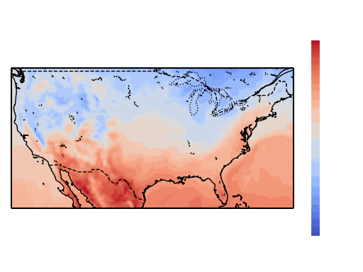{.lightbox group="data_samples"}

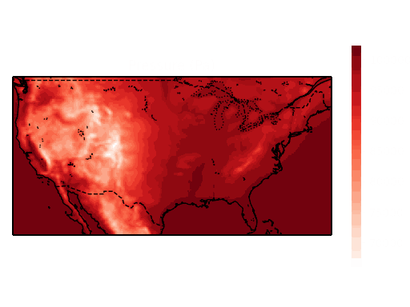{.lightbox group="data_samples"}

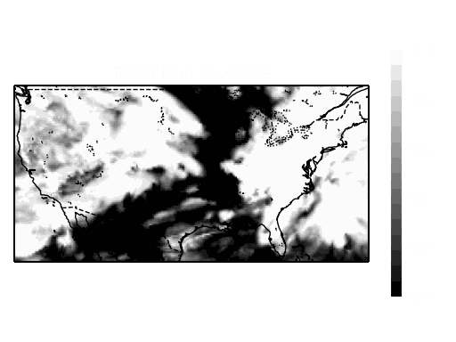{.lightbox group="data_samples"}

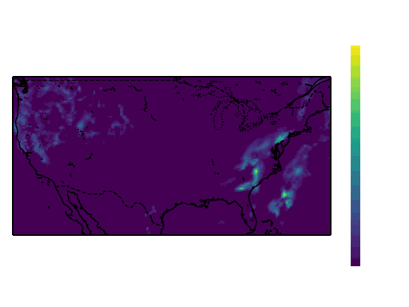{.lightbox group="data_samples"}
:::

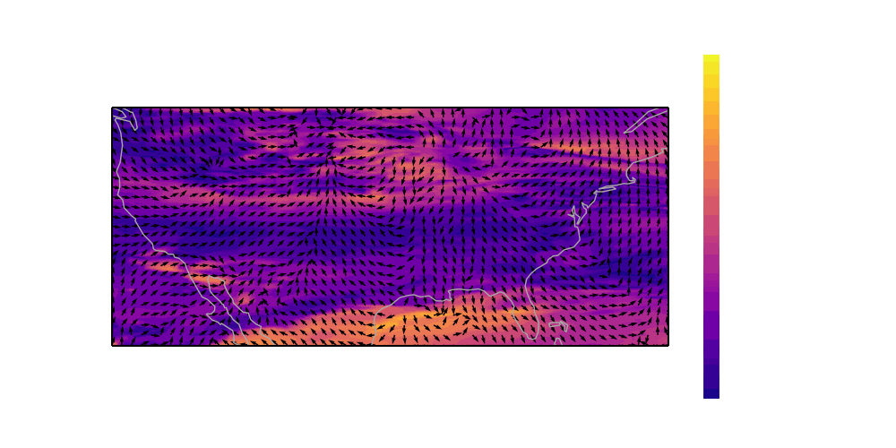{.lightbox group="data_samples"}

The total size of this dataset was around 2.6 GB and was converted from the .grib file format to the .zarr format and chunked into 24 hour chunks to improve the performance of reading the dataset. The models read the previous 3 hours of all 6 of these variables to predict the next 3 hours of precipitation, so the dataset was split into 6-hour intervals before it was split into training, validation and test sets to prevent leakage between the sets.

I randomly split the data into 80% training, 10% validation and 10% testing using a stratified split across all 12 months to ensure even coverage across the seasons in each dataset. 

::: {.callout-note}
In retrospect, a temporal split would have made more sense than the random split used here due to the autocorrelation between the the time lagged steps, leading to optimistic results.
:::

## Preprocessing

Most of the variables in this dataset were very large or sparse and needed to be cleaned up before they are used for training. All of the values for preprocessing were saved from only the training set to prevent data leakage. 

- Wind (u & v components): Normalized to [-1, 1], so that the direction of the wind would be preserved
- Temperature: Transformed using a z-score standardization because the distribution of the variable was already normal, but the values were too big
- Total Cloud Coverage: None, the values were already between [0, 1]
- Surface Pressure: Normalized to [0, 1] because the distribution wasn't normal and the values were too big
- Total Precipitation: This variable was very sparse, so it was scaled up to mm, then transformed to log scale so that the model had more information to train off of.

:::{layout-ncol=2}
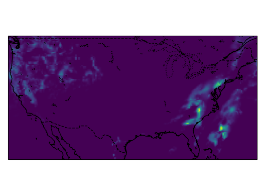{.lightbox group="log_example"}

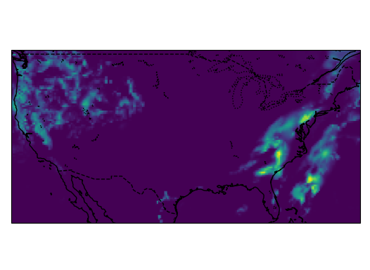{.lightbox group="log_example"}
:::

## Evaluation

To measure my model's performance, I used 5 metrics where: 

::: {.callout}
- $P$: Model Prediction
- $G$: Ground truth
:::

- Root Mean Squared Error (RMSE): This measures the difference between the predicted rain vs the actual rain averaged.
  - $\sqrt{\frac{\sum_{i,j}(G_{i,j}-P_{i,j})^2}{ij}}$
- Correlation: This measures how strongly correlated the model predictions are with the ground truth. This metric is less affected by outliers
  - $\frac{\sum_{i,j}P_{i,j}G_{i,j}}{\sqrt{(\sum_{i,j}P_{i,j}^2) {(\sum_{i,j}G_{i,j}}^2)} + \epsilon}$ where $\epsilon = 10^{-9}$

My other 3 metrics are from meteorology, where I applied a threshold of 0.5mm/h of rain to the model predictions to see how well the model is able to predict the intensity of the rain being above the threshold. This creates a 2x2 contingency matrix out of the model predictions

|  |  | **Event Observed: Yes** | **Event Observed: No** |
|--|--|------------------------|------------------------|
| **Event Forecast** | **Yes** | Hits | False Alarms |
| **Event Forecast** | **No** | Misses | Correct Rejections |

: 2x2 Contingency Matrix {.hover .bordered .sm .dark}

:::{.callout}
$hits$: number of times the model predicted rainfall correctly

$false\ alarms$: number of times the model predicts rain but it doesn't rain

$misses$: number of times the model doesn't predict rain, but it does rain
:::
- Critical Success Index (CSI): How often the model predicts correctly (1 is the best value)
  - $\frac{hits}{hits+misses+false\ alarms}$
- False Alarm Ratio (FAR): How often the model makes false alarms (0 is the best value)
  - $\frac{false\ alarms}{false\ alarms+hits}$
- Probability Of Detection (POD): how often the model predicts events that do happen (1 is the best value)
  - $\frac{hits}{hits+misses}$

# Baseline

To ensure my model results are meaningful, I first built a very simple model that just assumes the precipitation over the next 3 hours is the same as it was on the most recent hour. This model was used to ensure my new models were actually performing well.

| RMSE | Correlation | CSI | FAR | POD |
|------|-------------|-----|-----|-----|
| 0.394 | 0.621 | 0.411 | 0.411 | 0.575 |

: Baseline Results {.hover .bordered .sm .dark}

# Initial Design

As my baseline model to improve off of, I used the ConvLSTM from [this paper](https://arxiv.org/abs/1506.04214). This model architecture uses a standard LSTM, but replaces the fully connected layers with convolutions and stores its hidden states as 3D tensors, where the last 2 dimensions are spatial. This helps the model keep track of both the spatial and temporal dependencies needed to make accurate predictions. 

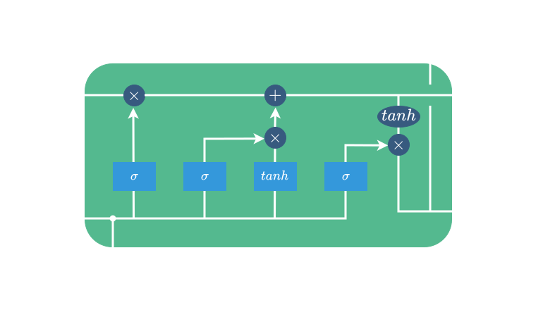{.lightbox}

Because the model is taking all 6 variables for only the first 3 hours, and is predicting only the precipitation on the last 3 hours without looking at the other variables, I used an encoder-decoder structure, where the encoder ran through the first 3 hours and the decoder predicted the last 3 hours.

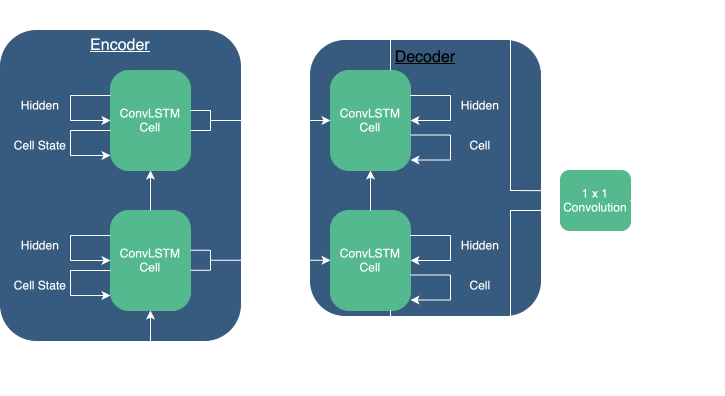{.lightbox}

The parameters I used to train the network are a follows:

- Hidden State / Cell State Layers: 20
- Kernel Size: 5
- Optimizer: AdamW
- Learning Rate: 1e-4
- Epochs: 30
- Loss Function: Mean Squared Error

| RMSE | Correlation | CSI | FAR | POD |
|------|-------------|-----|-----|-----|
| 0.303 | 0.743 | 0.491 | 0.307 | 0.627 |

: Initial Results {.hover .bordered .sm .dark}

{.lightbox}

# Improvements

This network was being trained on my laptop and the graph that PyTorch uses to calculate back-propagation was so large that it was almost maxing out the storage on my laptop. This is due to the recurrent nature of the model and the large size of the hidden states leading to very large computation graphs. To reduce the strain on my laptop's storage while keeping the performance as similar as possible to the current model, I tried changing the architecture of this model to a ConvGRU. 

## ConvGRU

The GRU (Gated Recurrent Unit) is a special version of an RNN, which uses gates in the same way as the LSTM to prevent exploding or vanishing gradients, however it drops the cell state that the LSTM used for long-term dependencies. This reduces the number of parameters significantly, but loses some performance in long sequences. My use case only had short input and output sequence lengths so I expected the model to work well here. The GRU was converted into a ConvGRU by replacing the fully connected layers with convolutions, just like what was done for the ConvLSTM. 

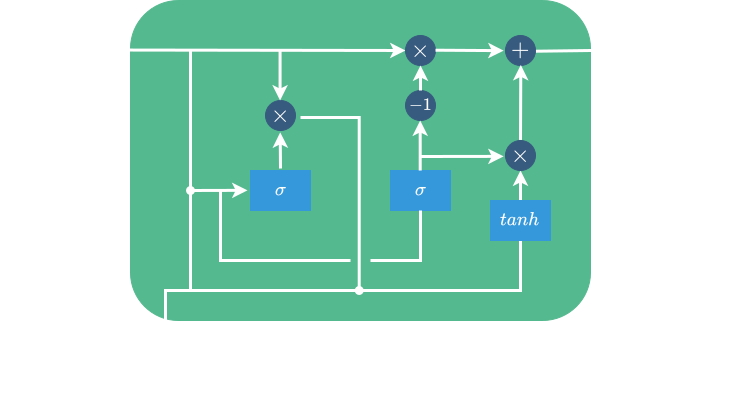{.lightbox}

The basic idea for the rest of my model's architecture stayed the same, but was simplified due to the removal of the cell states. This change reduced the number of parameters by around 25%.

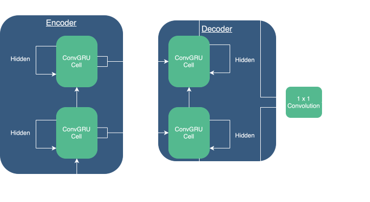{.lightbox}

When training this model I kept all of the other parameters the same. The change in architecture led to a small increase in forecasting abilities, but no improvement in my other metrics

| RMSE | Correlation | CSI | FAR | POD |
|------|-------------|-----|-----|-----|
| 0.305 | 0.743 | 0.500 | 0.303 | 0.639 |

: ConvGRU Results {.hover .bordered .sm .dark}

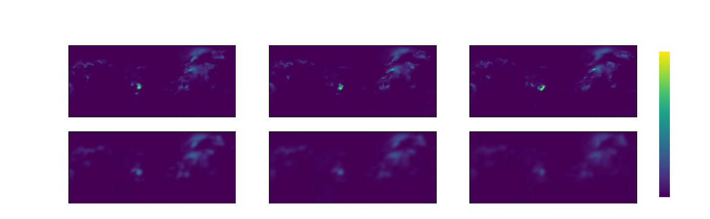{.lightbox}

## Sharpening Predictions with a Spatial Loss

An issue I wanted to address in these predictions were the fuzziness in the predictions made by the model. I tried penalizing the model for having fuzzy predictions by adding another loss function on-top of the mean squared error currently being used. This loss function is called the spatial loss which uses the mean squared error between the image gradients of the predictions and ground truths. The image gradient is used in image processing to find the edges of objects in an image, however here we are using it to penalize the model for having softer edges than the actual predictions. 

{.lightbox}

I couldn't just add the losses for each error function, and finding the perfect weights on each would be time consuming, so I normalized both values before applying gradient descent. The actual gradient applied to the network could be greater than 1, but the loss values were always 1, which prevented the networks from fighting with each other for dominance. 

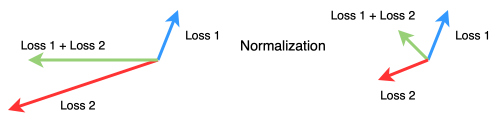

Combining this new loss function with the ConvGRU architecture, I got these results.

| RMSE | Correlation | CSI | FAR | POD |
|------|-------------|-----|-----|-----|
| 0.299 | 0.753 | 0.507 | 0.299 | 0.647 |

: Best Model Results {.hover .bordered .sm .dark}

{.lightbox}

# Final Results

The change in model architecture and loss functions led to improvements in the forecasting abilities of my model over my baseline.

| Model | RMSE | Correlation | CSI | FAR | POD |
|-------|------|-------------|-----|-----|-----|
| Baseline | 0.394 | 0.621 | 0.411 | 0.411 | 0.575 |
| ConvLSTM | 0.303 | 0.743 | 0.491 | 0.307 | 0.627 |
| ConvGRU | 0.305 | 0.743 | 0.500 | 0.303 | 0.639 |
| [**ConvGRU + Spatial**]{.underline} | [**0.299**]{.underline} | [**0.753**]{.underline} | [**0.507**]{.underline} | [**0.299**]{.underline} | [**0.647**]{.underline} |

: Overall results {.hover .bordered .sm .dark}

# Conclusion

Overall, this was a fun and challenging project that taught me a lot about the challenges in weather forecasting, recurrent neural networks and working with the limitations of my hardware. There are several issues with this project that I hope to address in future work. The first of these is the fuzziness in my model's outputs. even though adding another loss function that targeted the edges of predicted rainfall led to overall improvements to model performance, there is still a lot that could be improved here. The best solution I want to explore next is the GAN (Generative Adversarial Network) which penalizes the model's fuzzy outputs using a discriminator network to address this problem. 

Another area of future work is the network's performance over time. As can be seen in the table below, the best model's performance drops rapidly over the course of the 3 hours. This may be due to the small number of layers in my model, but I would also like to explore more modern approaches to this problem, such as introducing attention or swapping over to a transformer-based architecture to help the model with recognizing time-dependent relationships better.

| Metric | +1 hour | +2 hour | +3 hour |
|--------|---------|---------|---------|
| RMSE | 0.232 | 0.305 | 0.347 |
| Correlation | 0.861 | 0.741 | 0.641 |
| CSI | 0.637 | 0.502 | 0.397 |
| FAR | 0.200 | 0.306 | 0.398 |
| POD | 0.757 | 0.645 | 0.537 |

: Performance of best model overtime {.hover .bordered .sm .dark}

# References

Better weather warnings can save lives and billions of dollars globally: Published by Journal of Health Economics and Outcomes Research. Journal of Health Economics and Outcomes Research. (n.d.). https://jheor.org/post/2024-better-weather-warnings-can-save-lives-and-billions-of-dollars-globally 

Ecmwf. (2026, March 16). ERA5 hourly data on single levels from 1940 to present. https://cds.climate.copernicus.eu/datasets/reanalysis-era5-single-levels?tab=overview 

Shi, X., Chen, Z., Wang, H., Yeung, D.-Y., Wong, W., & Woo, W. (2015, September 19). Convolutional LSTM network: A machine learning approach for precipitation nowcasting. arXiv.org. https://arxiv.org/abs/1506.04214 

Understanding LSTM networks. Understanding LSTM Networks -- colah’s blog. (n.d.). https://colah.github.io/posts/2015-08-Understanding-LSTMs/ 

Weather forecasting | methods, importance, & history | britannica. (n.d.-c). https://www.britannica.com/science/weather-forecasting 

Forecast verification glossary a accuracy. (n.d.-b). https://www.swpc.noaa.gov/sites/default/files/images/u30/Forecast%20Verification%20Glossary.pdf 

Strategies for balancing multiple loss functions in deep learning | by Baicen Xiao | Medium. (n.d.-d). https://medium.com/@baicenxiao/strategies-for-balancing-multiple-loss-functions-in-deep-learning-e1a641e0bcc0 
